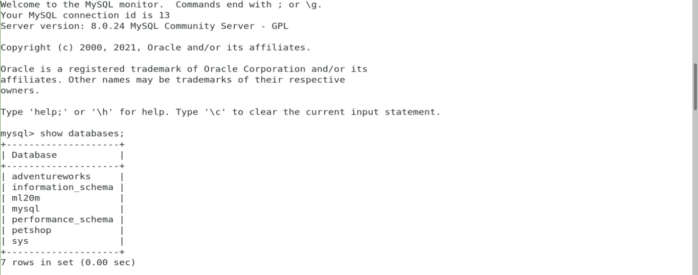

# Data Warehouse com Apache Hive
### Projeto nº5 da Formação Cientista de Dados da Data Science Academy

## Introdução

O objetivo deste projeto é implementar um *data warehouse* rodando sobre um *data lake* com Apache Hadoop, transferindo os dados de um banco de dados MySQL para o Apache Hive rodando sobre o sistema de arquivos HDFS de um cluster Hadoop, permitindo manipulações com o Apache Spark.

O projeto será executado dois passos:
- Passo 1 - carregar o banco de dados no MySQL;
- Passo 2 - transferir o banco de dados do MySQL para o HDFS e para o Hive;

Requisitos para execução do projeto como descrito neste documento:
- Sistema operacional Linux;
- Cluster Apache Hadoop instalado com Apache Hive, Apache Sqoop e Apache Spark;
- RDBMS MySQL instalado e um banco de dados a ser transferido para o cluster;
- JDBC MySQL instalado para fazer a conexão entre o MySQL e o cluster Hadoop.

## Carga de dados no MySQL:

Dado o banco de dados AWBackup.sql anexo ao projeto, para fazer a carga deste banco de dados no MySQL basta digitar no terminal o seguinte comando:

`mysql -u root -p < ./AWBackup.sql`

Alternativamente, pode-se executar o script import_adventurework.sh.

Verificando se foi criado o novo banco de dados no MySQL:


```
mysql> use adventureworks;
Reading table information for completion of table and column names
You can turn off this feature to get a quicker startup with -A

Database changed
mysql> show tables;
+---------------------------------------+
| Tables_in_adventureworks              |
+---------------------------------------+
| address                               |
| addresstype                           |
| awbuildversion                        |
| billofmaterials                       |
| contact                               |
| contactcreditcard                     |
| contacttype                           |
| countryregion                         |
| countryregioncurrency                 |
| creditcard                            |
| culture                               |
| currency                              |
| currencyrate                          |
| customer                              |
| customeraddress                       |
| databaselog                           |
| department                            |
| document                              |
| employee                              |
| employeeaddress                       |
| employeedepartmenthistory             |
| employeepayhistory                    |
| errorlog                              |
| illustration                          |
| individual                            |
| jobcandidate                          |
| location                              |
| product                               |
| productcategory                       |
| productcosthistory                    |
| productdescription                    |
| productdocument                       |
| productinventory                      |
| productlistpricehistory               |
| productmodel                          |
| productmodelillustration              |
| productmodelproductdescriptionculture |
| productphoto                          |
| productproductphoto                   |
| productreview                         |
| productsubcategory                    |
| productvendor                         |
| purchaseorderdetail                   |
| purchaseorderheader                   |
| salesorderdetail                      |
| salesorderheader                      |
| salesorderheadersalesreason           |
| salesperson                           |
| salespersonquotahistory               |
| salesreason                           |
| salestaxrate                          |
| salesterritory                        |
| salesterritoryhistory                 |
| scrapreason                           |
| shift                                 |
| shipmethod                            |
| shoppingcartitem                      |
| specialoffer                          |
| specialofferproduct                   |
| stateprovince                         |
| store                                 |
| storecontact                          |
| transactionhistory                    |
| transactionhistoryarchive             |
| unitmeasure                           |
| vendor                                |
| vendoraddress                         |
| vendorcontact                         |
| workorder                             |
| workorderrouting                      |
+---------------------------------------+
70 rows in set (0.00 sec)

```
Constata-se, então, que o banco de dados está acessível localmente através do MySQL RDBMS, onde constatou-se que possui 70 tabelas, e localmente pode-se fazer manipulações nestes dados através de linguagem SQL.


## Carga de dados no *data lake*:

Para carga de dados no *data lake*, a primeira coisa a ser feita é se certificar que os serviços do HDFS e do Yarn foram inicializados corretamente, conforme mostrado:

```
[hadoop@dataserver ~]$ jps
4066 Jps
[hadoop@dataserver ~]$ start-dfs.sh 
Starting namenodes on [localhost]
Starting datanodes
Starting secondary namenodes [dataserver]
[hadoop@dataserver ~]$ start-yarn.sh 
Starting resourcemanager
Starting nodemanagers
[hadoop@dataserver ~]$ jps
4384 DataNode
5156 NodeManager
4598 SecondaryNameNode
4251 NameNode
5020 ResourceManager
6077 Jps

```

Pode-se utilizar o Apache Sqoop para fazer a carga dos dados do banco de dados relacional para o HDFS. Para isto basta executar o seguinte comando no terminal:

```
sqoop import-all-tables --connect jdbc:mysql://localhost:3306/adventureworks?serverTimezone=UTC --username root --password Dsahadoop@1 --m 1

```
O comando acima executado importa para o HDFS todas as 70 tabelas do banco de dados *adventureworks* rodando na máquina local, acessado pela porta 3306 (padrão do MySQL), através do driver JDBC. A saída do terminal pode ser observada no arquivo sqoop_to_hdfs.log. Abaixo pode-se verificar que os dados foram transferidos para a estrutura /user/hadoop/ em formato texto, em um diretório para cada uma das tabelas do banco de dados.

```
[hadoop@dataserver ~]$ hdfs dfs -ls /user/hadoop
Found 70 items
drwxr-xr-x   - hadoop supergroup          0 2021-05-19 12:59 /user/hadoop/address
drwxr-xr-x   - hadoop supergroup          0 2021-05-19 12:59 /user/hadoop/addresstype
drwxr-xr-x   - hadoop supergroup          0 2021-05-19 13:00 /user/hadoop/awbuildversion
drwxr-xr-x   - hadoop supergroup          0 2021-05-19 13:00 /user/hadoop/billofmaterials
drwxr-xr-x   - hadoop supergroup          0 2021-05-19 13:00 /user/hadoop/contact
drwxr-xr-x   - hadoop supergroup          0 2021-05-19 13:01 /user/hadoop/contactcreditcard
drwxr-xr-x   - hadoop supergroup          0 2021-05-19 13:01 /user/hadoop/contacttype
drwxr-xr-x   - hadoop supergroup          0 2021-05-19 13:02 /user/hadoop/countryregion
drwxr-xr-x   - hadoop supergroup          0 2021-05-19 13:02 /user/hadoop/countryregioncurrency
drwxr-xr-x   - hadoop supergroup          0 2021-05-19 13:02 /user/hadoop/creditcard
drwxr-xr-x   - hadoop supergroup          0 2021-05-19 13:03 /user/hadoop/culture
drwxr-xr-x   - hadoop supergroup          0 2021-05-19 13:03 /user/hadoop/currency
drwxr-xr-x   - hadoop supergroup          0 2021-05-19 13:03 /user/hadoop/currencyrate
drwxr-xr-x   - hadoop supergroup          0 2021-05-19 13:04 /user/hadoop/customer
drwxr-xr-x   - hadoop supergroup          0 2021-05-19 13:04 /user/hadoop/customeraddress
drwxr-xr-x   - hadoop supergroup          0 2021-05-19 13:05 /user/hadoop/databaselog
drwxr-xr-x   - hadoop supergroup          0 2021-05-19 13:05 /user/hadoop/department
drwxr-xr-x   - hadoop supergroup          0 2021-05-19 13:05 /user/hadoop/document
drwxr-xr-x   - hadoop supergroup          0 2021-05-19 13:06 /user/hadoop/employee
drwxr-xr-x   - hadoop supergroup          0 2021-05-19 13:06 /user/hadoop/employeeaddress
drwxr-xr-x   - hadoop supergroup          0 2021-05-19 13:07 /user/hadoop/employeedepartmenthistory
drwxr-xr-x   - hadoop supergroup          0 2021-05-19 13:07 /user/hadoop/employeepayhistory
drwxr-xr-x   - hadoop supergroup          0 2021-05-19 13:07 /user/hadoop/errorlog
drwxr-xr-x   - hadoop supergroup          0 2021-05-19 13:08 /user/hadoop/illustration
drwxr-xr-x   - hadoop supergroup          0 2021-05-19 13:08 /user/hadoop/individual
drwxr-xr-x   - hadoop supergroup          0 2021-05-19 13:08 /user/hadoop/jobcandidate
drwxr-xr-x   - hadoop supergroup          0 2021-05-19 13:09 /user/hadoop/location
drwxr-xr-x   - hadoop supergroup          0 2021-05-19 13:09 /user/hadoop/product
drwxr-xr-x   - hadoop supergroup          0 2021-05-19 13:10 /user/hadoop/productcategory
drwxr-xr-x   - hadoop supergroup          0 2021-05-19 13:10 /user/hadoop/productcosthistory
drwxr-xr-x   - hadoop supergroup          0 2021-05-19 13:10 /user/hadoop/productdescription
drwxr-xr-x   - hadoop supergroup          0 2021-05-19 13:11 /user/hadoop/productdocument
drwxr-xr-x   - hadoop supergroup          0 2021-05-19 13:11 /user/hadoop/productinventory
drwxr-xr-x   - hadoop supergroup          0 2021-05-19 13:12 /user/hadoop/productlistpricehistory
drwxr-xr-x   - hadoop supergroup          0 2021-05-19 13:12 /user/hadoop/productmodel
drwxr-xr-x   - hadoop supergroup          0 2021-05-19 13:12 /user/hadoop/productmodelillustration
drwxr-xr-x   - hadoop supergroup          0 2021-05-19 13:13 /user/hadoop/productmodelproductdescriptionculture
drwxr-xr-x   - hadoop supergroup          0 2021-05-19 13:13 /user/hadoop/productphoto
drwxr-xr-x   - hadoop supergroup          0 2021-05-19 13:14 /user/hadoop/productproductphoto
drwxr-xr-x   - hadoop supergroup          0 2021-05-19 13:14 /user/hadoop/productreview
drwxr-xr-x   - hadoop supergroup          0 2021-05-19 13:14 /user/hadoop/productsubcategory
drwxr-xr-x   - hadoop supergroup          0 2021-05-19 13:15 /user/hadoop/productvendor
drwxr-xr-x   - hadoop supergroup          0 2021-05-19 13:15 /user/hadoop/purchaseorderdetail
drwxr-xr-x   - hadoop supergroup          0 2021-05-19 13:16 /user/hadoop/purchaseorderheader
drwxr-xr-x   - hadoop supergroup          0 2021-05-19 13:16 /user/hadoop/salesorderdetail
drwxr-xr-x   - hadoop supergroup          0 2021-05-19 13:16 /user/hadoop/salesorderheader
drwxr-xr-x   - hadoop supergroup          0 2021-05-19 13:17 /user/hadoop/salesorderheadersalesreason
drwxr-xr-x   - hadoop supergroup          0 2021-05-19 13:17 /user/hadoop/salesperson
drwxr-xr-x   - hadoop supergroup          0 2021-05-19 13:18 /user/hadoop/salespersonquotahistory
drwxr-xr-x   - hadoop supergroup          0 2021-05-19 13:18 /user/hadoop/salesreason
drwxr-xr-x   - hadoop supergroup          0 2021-05-19 13:18 /user/hadoop/salestaxrate
drwxr-xr-x   - hadoop supergroup          0 2021-05-19 13:19 /user/hadoop/salesterritory
drwxr-xr-x   - hadoop supergroup          0 2021-05-19 13:19 /user/hadoop/salesterritoryhistory
drwxr-xr-x   - hadoop supergroup          0 2021-05-19 13:20 /user/hadoop/scrapreason
drwxr-xr-x   - hadoop supergroup          0 2021-05-19 13:20 /user/hadoop/shift
drwxr-xr-x   - hadoop supergroup          0 2021-05-19 13:20 /user/hadoop/shipmethod
drwxr-xr-x   - hadoop supergroup          0 2021-05-19 13:21 /user/hadoop/shoppingcartitem
drwxr-xr-x   - hadoop supergroup          0 2021-05-19 13:21 /user/hadoop/specialoffer
drwxr-xr-x   - hadoop supergroup          0 2021-05-19 13:21 /user/hadoop/specialofferproduct
drwxr-xr-x   - hadoop supergroup          0 2021-05-19 13:22 /user/hadoop/stateprovince
drwxr-xr-x   - hadoop supergroup          0 2021-05-19 13:22 /user/hadoop/store
drwxr-xr-x   - hadoop supergroup          0 2021-05-19 13:23 /user/hadoop/storecontact
drwxr-xr-x   - hadoop supergroup          0 2021-05-19 13:23 /user/hadoop/transactionhistory
drwxr-xr-x   - hadoop supergroup          0 2021-05-19 13:23 /user/hadoop/transactionhistoryarchive
drwxr-xr-x   - hadoop supergroup          0 2021-05-19 13:24 /user/hadoop/unitmeasure
drwxr-xr-x   - hadoop supergroup          0 2021-05-19 13:24 /user/hadoop/vendor
drwxr-xr-x   - hadoop supergroup          0 2021-05-19 13:25 /user/hadoop/vendoraddress
drwxr-xr-x   - hadoop supergroup          0 2021-05-19 13:25 /user/hadoop/vendorcontact
drwxr-xr-x   - hadoop supergroup          0 2021-05-19 13:26 /user/hadoop/workorder
drwxr-xr-x   - hadoop supergroup          0 2021-05-19 13:26 /user/hadoop/workorderrouting
[hadoop@dataserver ~]$ hdfs dfs -ls /user/hadoop/customer
Found 2 items
-rw-r--r--   1 hadoop supergroup          0 2021-05-19 13:04 /user/hadoop/customer/_SUCCESS
-rw-r--r--   1 hadoop supergroup    1746278 2021-05-19 13:04 /user/hadoop/customer/part-m-00000

```

## Carga de dados no *data warehouse*:

Contudo, utilizar o Apache Hive rodando sobre o HDFS permite uma maior facilidade na manipulação dos dados no cluster, pois pode-se utilizar a linguagem HQL, bastante similar ao já bem conhecido SQL padrão.

Antes de tudo, deve-se certificar que existe uma estrutura de diretórios no HDFS com permissão para escrita do usuário proprietário do banco de dados, para onde os arquivos serão direcionados, tal como:

```
[hadoop@dataserver ~]$ hdfs dfs -ls /user/hive
Found 1 items
drwxrwxrwx   - hadoop supergroup          0 2021-05-18 12:04 /user/hive/warehouse

```
Esta estrutura de diretórios é onde o Hive cria o *warehouse* no HDFS e armazena os dados. Assumindo que este projeto tens fins didáticos, sendo executado em um ambiente de teste apenas para demonstração do processo de carga de dados, as questões de segurança de dados serão relevadas.

Com o Hive devidamente configurado e o banco de dados *adventureworks* carregado no MySQL, utiliza-se o Sqoop para carga dos dados no Apache Hive. Bastando para isto digitar o comando no terminal com a sintaxe mostrada abaixo:

```
sqoop import --connect jdbc:mysql://localhost:3306/adventureworks?serverTimezone=UTC --username root --password Dsahadoop@1 --table customer --hive-import --map-column-hive rowguid=string --target-dir /user/hive/warehouse/adventureworks
```
Na prática, em relação à simples importação anterior para o HDFS, acrescenta-se as opções --table customer, para especificar qual tabela do banco de dados será importada, --hive-import, para especificar ao sqoop que a importação será feita para o Hive, --map-column-hive rowguid=string, acrescentada para contornar erros de tipos de dados não suportados pelo Hive e --target-dir /user/hive/warehouse/adventureworks para indicar qual o diretório onde o sqoop guardará os dados (caso não seja indicado, os dados serão gravados no diretório /user/hadoop, a menos que os arquivos de configuração indiquem outro diretório padrão).

O Sqoop gera um job mapreduce para realizar esta carga de dados para o Hive sobre o HDFS. Abaixo é mostrado o resumo deste job de carga da tabela customer:

```
2021-05-20 10:30:17,057 INFO mapreduce.Job: The url to track the job: http://localhost:8088/proxy/application_1621531182691_0002/
2021-05-20 10:30:17,057 INFO mapreduce.Job: Running job: job_1621531182691_0002
2021-05-20 10:30:26,354 INFO mapreduce.Job: Job job_1621531182691_0002 running in uber mode : false
2021-05-20 10:30:26,356 INFO mapreduce.Job:  map 0% reduce 0%
2021-05-20 10:30:40,678 INFO mapreduce.Job:  map 25% reduce 0%
2021-05-20 10:30:45,823 INFO mapreduce.Job:  map 50% reduce 0%
2021-05-20 10:30:46,835 INFO mapreduce.Job:  map 75% reduce 0%
2021-05-20 10:30:47,844 INFO mapreduce.Job:  map 100% reduce 0%
2021-05-20 10:30:47,862 INFO mapreduce.Job: Job job_1621531182691_0002 completed successfully
2021-05-20 10:30:47,970 INFO mapreduce.Job: Counters: 34
	File System Counters
		FILE: Number of bytes read=0
		FILE: Number of bytes written=919832
		FILE: Number of read operations=0
		FILE: Number of large read operations=0
		FILE: Number of write operations=0
		HDFS: Number of bytes read=483
		HDFS: Number of bytes written=1746278
		HDFS: Number of read operations=24
		HDFS: Number of large read operations=0
		HDFS: Number of write operations=8
		HDFS: Number of bytes read erasure-coded=0
	Job Counters 
		Killed map tasks=1
		Launched map tasks=4
		Other local map tasks=4
		Total time spent by all maps in occupied slots (ms)=62710
		Total time spent by all reduces in occupied slots (ms)=0
		Total time spent by all map tasks (ms)=62710
		Total vcore-milliseconds taken by all map tasks=62710
		Total megabyte-milliseconds taken by all map tasks=64215040
	Map-Reduce Framework
		Map input records=19185
		Map output records=19185
		Input split bytes=483
		Spilled Records=0
		Failed Shuffles=0
		Merged Map outputs=0
		GC time elapsed (ms)=412
		CPU time spent (ms)=6380
		Physical memory (bytes) snapshot=536674304
		Virtual memory (bytes) snapshot=10117267456
		Total committed heap usage (bytes)=243531776
		Peak Map Physical memory (bytes)=138088448
		Peak Map Virtual memory (bytes)=2529583104
	File Input Format Counters 
		Bytes Read=0
	File Output Format Counters 
		Bytes Written=1746278
2021-05-20 10:30:47,987 INFO mapreduce.ImportJobBase: Transferred 1.6654 MB in 34.5846 seconds (49.3096 KB/sec)
2021-05-20 10:30:47,990 INFO mapreduce.ImportJobBase: Retrieved 19185 records.

```
Com a carga de dados finalizada com sucesso, pode-se verificar no ambiente do Hive se os dados foram importados e estão acessíveis.

```
Hive-on-MR is deprecated in Hive 2 and may not be available in the future versions. Consider using a different execution engine (i.e. spark, tez) or using Hive 1.X releases.
Hive Session ID = 18acfa27-1452-47d2-82d2-8e0ddc209377
hive> show databases;
OK
default
Time taken: 0.79 seconds, Fetched: 1 row(s)
hive> use default;
OK
Time taken: 0.036 seconds
hive> show tables;
OK
customer
Time taken: 0.151 seconds, Fetched: 1 row(s)
hive> describe customer;
OK
customerid          	int                 	                    
territoryid         	int                 	                    
accountnumber       	string              	                    
customertype        	string              	                    
rowguid             	string              	                    
modifieddate        	string              	                    
Time taken: 0.46 seconds, Fetched: 6 row(s)

```
Verifica-se então que a tabela customer do banco de dados adventureworks foi importada com sucesso e pode ser acessada diretamente no cluster Hadoop através do Hive, podendo ser processada com linguagem HQL, ou ainda através pelo módulo SQL do Apache Spark.

## Conclusões
Conclui-se o presente trabalho fazendo-se as constatações que o framework Apache Hadoop oferece uma ampla gama de soluções open source para desenvolvimento de aplicações de *big data* em ambiente distribuído, com diversas possibilidades de integrações com as ferramentas do seu ecossistema. Neste trabalho, foram utilizados o Apache Sqoop como ferramenta de ETL para carga de dados de um banco de dados MySQL para um *datalake* HDFS e um *data warehouse* no Apache Hive. Com os dados disponíveis no HDFS ou no Hive, pode-se utilizar as vantagens computacionais de um cluster de computadores para processamento distribuído dos dados, criando diretamente jobs mapreduce, ou utilizando o próprio Apache Hive com sua linguagem HQL, ou até mesmo outras soluções do ecossistema Hadoop, como o Apache Mahout, Apache Pig e o Apache Spark. Como registro de aprendizado, ressalta-se que, apesar de a tarefa desenvolvida no presente trabalho ser bastante simples, foram enfrentados diversos erros no caminho, que exigiram um considerável tempo de pesquisa na documentação do Apache Hive e Apache Sqoop para que a carga de dados do banco de dados local pudesse ser carregada em um ambiente distribuído. Como possível extensão deste trabalho, pode ser acrescentada uma etapa de processamento dos dados armazenados no *cluster* Hadoop com o Apache Spark, tanto importando os dados diretamente do HDFS ou então importando as tabelas do Hive.